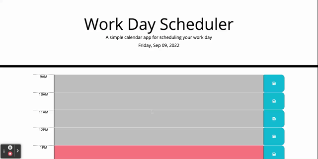

# work-day-scheduler

## Description

This project is a work day scheduler. The webpage is responsive to different screen sizes.

View the deployed website: https://ruxinqu.github.io/work-day-scheduler/

## Usage
* When a user opens the link to the application: the date of the current day is displayed on top of the time blocks.
* The time blocks' background color change based on the current time, to indicate whether it is in the past, present, or future. 
* The user input in each time block is saved to local storage.
* The animation below shows the web application's appearance and functionality: 

## Sources Referenced
Google || Youtube

## Technologies Used
* jQuery 
* Bootstrap 

