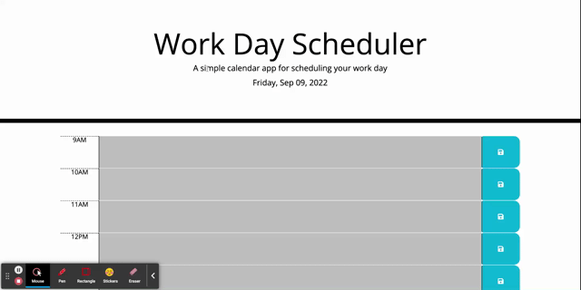

# work-day-scheduler

## Description

This project is a work day scheduler. The webpage is responsive to different screen sizes.

View the deployed website: https://ruxinqu.github.io/work-day-scheduler/

## Usage
* The date and the weekday are displayed on the top.
* Each time block is color-coded to indicate whether it is in the past, present, or future. 
* The user input is saved to local storage.
* The animation below shows the web application's appearance and functionality: 

## Sources Referenced
Google 

